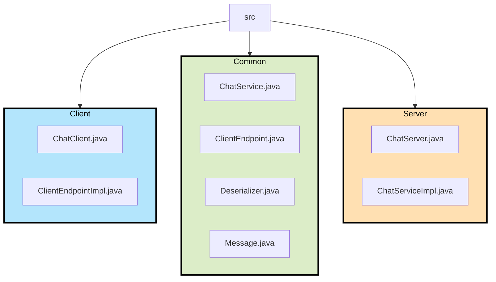

# Report

## Description of the software architecture

The SA is simple and follows traditional Client-Server apps



## Global functionality

1. The server register its service to the RMI object to be reachable by clients
2. If exists, it recovers history through a serialized dotfile
3. Client can then connect referring to the server by name referencing with the RMI
4. By joining, it passes its reference to the server, so they can establish connexion
5. Server saves clients references, manages and stores their messages
6. At each message reception, it stores the chat state for persistence
7. Server handle correctly client disconnection.

## Code organisation

```
.
├── *.sh (scripts)
└── src
    ├── README
    ├── client
    │   ├── ChatClient.java
    │   └── ClientEndpointImpl.java
    ├── common
    │   ├── ChatService.java
    │   ├── ClientEndpoint.java
    │   ├── Deserializer.java
    │   └── Message.java
    └── server
        ├── ChatServer.java
        ├── ChatServiceImpl.java
        └── serverdata
```

## Improvements 
* rewrite the history at each sending message is a bit overkill and could be improved by periodizing it
* role separation is bit messy since we mix up private and public methods in server
